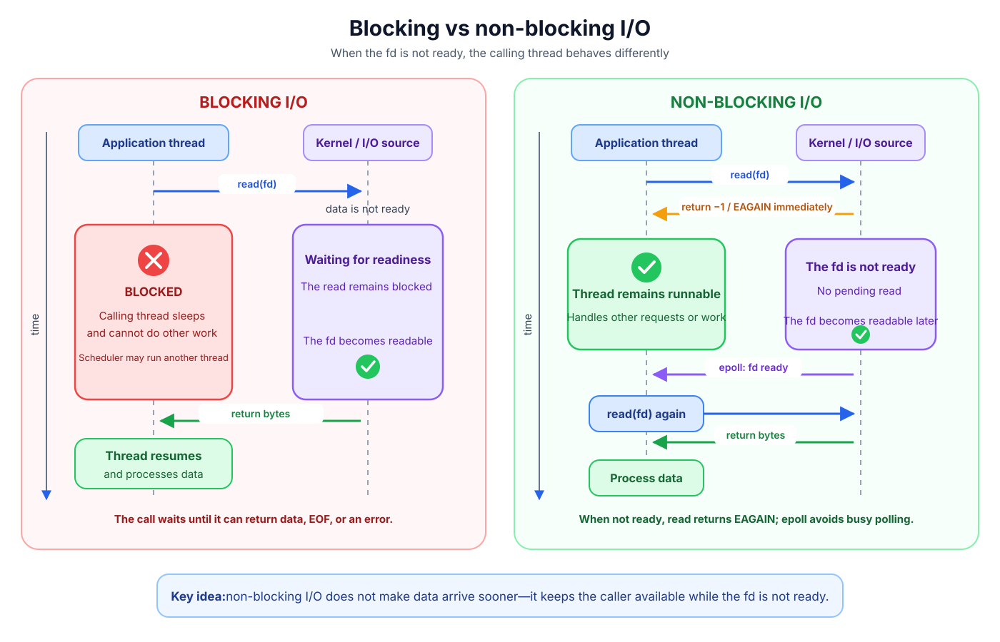

### File & file descriptor
**File**
- In Linux, everything is a file - file descriptors represent many kernel objects.
- Besides the regular file, these resources are considered as file: block device, terminal, pipe, socket.
- A file means it typically can be accessed by using the file interface: `read()`, `write()`, `close()` and `open()`. There are a few exceptions where it doesn't support full methods in the interface.

**File descriptor**
- A file descriptor is a non-negative integer indexing an entry in a process's file-descriptor table. 
- A file descriptor refers to a *open file description*. Multiple file descriptors can refer to the same open file description.
- A file descriptor is unique within a process.

**Open File Description**
- Open file description is a data structure that stores state such as the file offset, status flags like `O_NONBLOCK`, access mode, reference to the underlying inode, socket, pipe or other object.
- `open()` will create a new open file description
```
fd a → open file description A ─┐
                                ├→ same underlying file/inode
fd b → open file description B ─┘
```
- `dup()` and `fork()` will share the same open file description with the origin. That also means all related fds will share the same offset, file status and other information.
```
fd a ─┐
      ├→ same open file description → underlying file
fd b ─┘

b = dup(a)
```


**The central idea of the file interface**
open (create) a resource -> get a file descriptor -> read/write or operations supported by that resource

Linux provide the file interface through the Virtual File System (VFS), conceptually:

```
Application
    |
    | read(), write(), close()
    v
Linux VFS
    |
    +---- ext4
    +---- XFS
    +---- tmpfs
    +---- procfs
    +---- block-device driver
    +---- character-device driver
    +---- pipe implementation
    +---- socket implementation
```

**Some file types:**

| File type | Description |
| ---- | ----------- |
| [regular file](https://man7.org/linux/man-pages/man2/open.2.html) | use `open()` to open the file specify by path. If the file doesn't exist, it may optionally create a new file. |
| [pipe, fifo](https://man7.org/linux/man-pages/man7/pipe.7.html) | Provide uni-directional inter-processes communication. Pipe is anonymous and commonly used between related processes (parent/child). FIFO is a named file in the filesystem that allows completely unrelated processes to communicate. |
| [socket](https://man7.org/linux/man-pages/man7/socket.7.html) | Provide bi-directional inter-process communication locally on the same host or across a network  |
| tty | Stand for teletypewriter - a historical term for an electromechanical teleprinter. tty has evolved into a software abstraction representing any text-based input/output communication channel. Providing a universal interface to read user input and write text output, completely independent from underlying hardware. |
| [eventfd](https://man7.org/linux/man-pages/man2/eventfd.2.html) | providing inter-process event notification. It manages a single 64-bit unsigned integer. It can be used as an event wait/notify mechanism by userspace applications and by kernel applications to notify userspace applications about events. |
| [inotify](https://man7.org/linux/man-pages/man7/inotify.7.html) | The inotify API provides a mechanism for monitoring filesystem events. Inotify can be used to monitor individual files or to monitor directories.|

Read more about file: https://www.tecmint.com/everything-is-file-and-types-of-files-linux/

### System call in Linux
- System calls (aka `syscall`) are a set of functions that a user space application can request privileged service from the Linux kernel. 
- User space applications run with restricted permissions to ensure security; they can't directly touch the hardware or manipulate the memory layout without initiating a system call.
- Every system call will force a transition from user mode (low privilege) to kernel mode (high privilege). 
- The current thread is still running, but it will now execute kernel code.
- Some common system calls: `fork()`, `execve()`, `open()`, `read()`, etc.

How to tell if a function is a syscall or a library function?
- Section 2 of man pages is specifically for system calls, for instance `open(2)`, `read(2)`, `fork(2)`. These functions usually get mapped directly to syscalls.
- Section 3 is library functions, running in userspace, for instance, `printf(3)`, `malloc(3)`, `scan(3)`. These functions call make syscall internally.
- We can use `strace` to trace what system calls a program makes.

Read more about syscall: https://internals-for-interns.com/posts/linux-kernel-syscalls/
[syscall tables](https://github.com/torvalds/linux/blob/master/arch/x86/entry/syscalls/syscall_64.tbl)
[man syscall](https://man7.org/linux/man-pages/man2/syscalls.2.html)


### Blocking vs Non-Blocking syscall
**Blocking syscall**
When a thread (task) makes a syscall, and the operation can't make progress (wait indefinitely) because of a blocker (no data, lack of resources, resource locked, condition not met, etc), the kernel will:
1. Put the task on the wait queue associated with the blocker (resource/condition).
2. Change the task's state to `TASK_INTERRUPTIBLE` or `TASK_UNINTERRUPTIBLE`, so the scheduler will ignore it
3. Call the scheduler to find another runnable thread to run on the CPU
4. When the blocker is broken, whatever did that (interrupt handler, another process or thread, timer, etc) will call `wake_up()` on the wait queue. The task is transitioned to `TASK_RUNNING` and is ready to be scheduled again. The thread resumes inside the syscall, where it rechecks the condition. Then it may return to userspace with the result, sleep again, or return because of a timeout, signal, or error.
**Non-Blocking syscall**
When the syscall can't make progress, it will immediately return an error/indicator. The thread doesn't get sleep and keeps running. It's up to the userspace application to retry, poll or do something else.

**Some syscalls support both modes, some support one or the other**

These syscalls support both modes based on the flag or parameter:
- `read()`/`write()`/`recv()`/`send()`/`accept()` - `O_NONBLOCK` on the fd = non blocking, or `MSG_DONTWAIT` on per socket call (send, recv).
- `connect()` — with `O_NONBLOCK` returns `EINPROGRESS` immediately instead of waiting for TCP handshake.
- `waitpid()` - `WNOHANG` = non block
- `epoll_wait()`/`poll()`/`select()` - `timeout` is `0` means non block, `timeout` is `-1/NULL` means block indefinitely, `timeout` is `500` blocks for a limited time.
- `flock()` — `LOCK_NB` = non-block, don't wait on the lock
- `fcntl(F_SETLKW)` (wait) vs `fcntl(F_SETLK)` (don't wait)
- `getrandom()` — `GRND_NONBLOCK` returns `EAGAIN` instead of blocking on the entropy pool initialisation

These syscalls are blocking only:
- `fsync()`, `fdatasync()`, `msync(MS_SYNC)` - wait until the data hit the device
- `nanosleep()`/`clock_nanosleep()`
- `read()`/`write()` on a regular file (`O_NONBLOCK` is ignored) may complete immediately or may block.

Some syscalls are never blocked. It doesn't wait or depend on any resource or condition. Therefore, the distinction between blocking/non-blocking doesn't make sense here:
- `getpid()`, `getuid()`, `gettimeofday()`, `clock_gettime()` - pure state kernel/process getters
- `sched_yield()`
- `getpid()`

**blocking is not limited to I/O**
When talking about blocking syscalls, I/O syscalls make up the majority, but not all blocking syscalls are I/O syscalls. These are other blocking system calls that are not related to I/O:
- futex (fast userspace mutex) - a thread calling futex wait will sleep indefinitely until another thread wakes it up, timeout, interruption, and spurious wakeups
- semop (System V semaphores) - if a thread tries to decrement a semaphore whose value is zero, it will sleep indefinitely until another thread increments the semaphore
- wait/waitpid - block the calling process until the child process changes its state
- flock - the calling thread will sleep indefinitely if the lock cannot be acquired immediately

### Blocking I/O
As explained above, if a thread makes an I/O syscall such as `read()` or `write()` on an fd and can't make progress, the OS can put the calling thread to sleep. When the fd is ready to make progress, the thread will be woken and placed in the queue to run. The thread will then resume the I/O syscall and continue to execute. 

Consider some examples:

**Regular file (without `O_DIRECT`, `O_SYNC`, or `O_DSYNC`)**
In a regular file on a disk-backed filesystem, there is no producer/consumer relationship, and there is no fixed buffer to be full or empty, like a pipe or socket.

- To read, the kernel will check the page cache. If it's a cache hit, it usually returns immediately without blocking. If it's a cache miss or the data is not up to date, the kernel usually must issue a disk read and put the calling thread to sleep. After the data is read into the page cache, the calling thread will be rescheduled and resume.
- To write, the kernel copies the data into the page cache and marks it as dirty, then returns almost immediately. The data in the page cache will be written back to disk asynchronously by kernel threads. It can still be blocked by memory pressure, where too many dirty pages are in the page cache; it must wait until the kernel's dirty-page throttling has finished flushing.

**pipe**
Get blocked:
- The reader is blocked when the receive buffer is empty
- writer blocked when the send buffer is full, no room to accept more bytes.

Wake up:
- Writer wakes up: When a reader drains some bytes from the buffer. When the reader closes the pipe (closes all the descriptors referring to the read end), it wakes the writers who are waiting; writers get `SIGPIPE/EPIPE`, meaning no one else is reading the data.
- When a writer writes some bytes to an empty buffer. When the writer closes the pipe (closes all descriptors referring to the write end), it will wake those readers waiting on; the reader will read all remaining data and get `EOF`, meaning no more data will ever come
- because dup() and fork() can create additional references, closing one descriptor is not sufficient.

**TCP socket**
Get blocked:
- The reader is not ready when the buffer is empty; no data has arrived from the peer yet.
- Writer is not ready in two cases: the local send buffer is full, or indirectly blocked by TCP congestion control, which slows the transmission and ack, causing the buffer to fill.
Wake up:
- Blocked writer wakes up when: ACK signal from peer confirming that the data has been received, send buffer space free up. Reader sends `RST`; writer wakes up and gets `ECONNRESET` or `EPIPE`.
- blocked reader wakes up when: new data segments queue up to the receive buffer. writer sends `FIN` (orderly close), reader wakes up, reads all remaining data, and finally gets `EOF`.
- connection lost (timeout, network unreachable): eventually returns `ETIMEDOUT`/`EHOSTUNREACH`



### Non-blocking I/O
- A regular file doesn't support non-blocking. If you set `O_NONBLOCK` on a regular file, it will succeed, but it will not make subsequent `read()` and `write()` calls non-blocking; those calls may still block.
- If the file type supports non-blocking, we can call `open()` with `O_NONBLOCK` or later time with `fcntl(fd, F_SETFL, flags | O_NONBLOCK)`
- Some file types (objects) that support `O_NONBLOCK`: pipe, fifo, socket, eventfd, inotify, etc.
- After opening the file and getting the fd, `read()` or `write()` will return `-1` and set `errno` to `EAGAIN` or `EWOULDBLOCK` immediately if it can't make progress. The current thread will continue to execute.
- Non-blocking IO is commonly paired with a readiness API such as `select`, `poll` and `epoll`
- Besides notifiers, Non-blocking I/O can be paired with busy waiting in some niche situations.


- Those objects support non-blocking, such as those that usually have two sides, a producer and a consumer, and there is a small buffer to read or write to. The reader is blocked when the buffer is empty, and the writer is blocked when the buffer is full. Since there are two sides, there are messages when each of them closes its end.

**io_uring**
`O_NONBLOCK` doesn't make the regular file reads and writes non-blocking. To achieve non-blocking-like experience on a regular file, asynchronous interfaces such as io_uring or AIO allow applications to submit I/O operations and collect their result separately.

### pollable/nonpollable file descriptor
- A file/fd is pollable if it has `.poll()` implementation on the `file_operations` struct:
```c
struct file_operations {
    // ...
	__poll_t (*poll) (struct file *, struct poll_table_struct *);
    // ...
}
```
Source: [file_operations.poll()](https://github.com/torvalds/linux/blob/2709dd5ae32f0828f386327c76bba9f39f63a1c6/include/linux/fs.h#L1931)

File types such as pipe or socket implement `file_operations.poll()` to:
- Firstly, return a bitmask describing their current readiness. Readiness is not just data ready to read or space to write; readiness means the operation can return without waiting for relevant I/O condition. Its result may be data, EOF, or an error. Writable readiness doesn't guarantee that a super large write will complete without blocking.
- Secondly, the `file_operations.poll()` usually call `poll_wait()` on its wait queue. `poll_wait()` invokes the callback supplied in the `poll_table` if one exists. `select()` and `poll()` have similar callback, while `epoll_ctl(ADD)` has different.
- `file_operations.poll()` is used by [`select`](https://man7.org/linux/man-pages/man2/select.2.html), [`poll`](https://man7.org/linux/man-pages/man2/poll.2.html) and [`epoll`](https://man7.org/linux/man-pages/man7/epoll.7.html).
- However, `select`, `poll` and `epoll` will not call `.poll()` directly; they call via `vfs_poll()`. The `vfs_poll()` then calls `.poll()` on the fd; if the fd doesn't have `.poll()` implementation, it will return a default readiness result.
- Ordinary storage-backed, such as regular files, generally do not implement the `file_operations.poll()` method. `poll` generally treats them as always ready, while `epoll` normally can't monitor them.

Source: [poll_wait() and vfs_poll()](https://github.com/torvalds/linux/blob/2709dd5ae32f0828f386327c76bba9f39f63a1c6/include/linux/poll.h#L37-L83)

### Pollable vs Non-Blocking I/O
Pollable and non-blocking I/O are two different things, but they are usually used together: 
- `O_NONBLOCK` prevents the operation from being blocked (sleep) when you make an I/O syscall on a fd that cannot make progress, the operation will return `EAGAIN` immediately instead.
- `file_operations.poll()` answers the question of whether the file descriptor can make progress yet, and is used by select, poll and epoll.

### Linux Readiness API (notifier): select, poll and epoll
- This is usually combined with non-blocking IO on a pollable file descriptor
- These are three mechanisms so that the kernel can notify the user space applications what file descriptors are ready:

#### [select](https://man7.org/linux/man-pages/man2/select.2.html)
```c
// before the `select` call,
// sets a fd to build the `fd_set`,
//fd's number-value to register to `fd_set` must be below `FD_SETSIZE`, normally 1024.
void FD_SET(int fd, fd_set *set);

// passes three `fd_set`s and block until
// returns number of ready fd (can duplicate) across all three `fd_sets ',
// input `fd_set's will be modified on function returning.
int select(int nfds, fd_set *_Nullable restrict readfds,
                  fd_set *_Nullable restrict writefds,
                  fd_set *_Nullable restrict exceptfds,
                  struct timeval *_Nullable restrict timeout);

// select() behavior
//     ├─ scan requested descriptor numbers
//     ├─ call vfs_poll() for each selected FD     ← O(n) time complexity
//     │    ├─ call file_operations.poll()         ← driver/socket/pipe poll()
//     │      ├─ poll_wait() temporarily registers the calling thread
//     │      ├─ returns current readiness
//     ├─ if anything is ready: return
//     └─ otherwise: sleep, wake, and scan again

// after select returns,
// checks if an fd is ready (set) or not
int  FD_ISSET(int fd, const fd_set *set);

```
- Each `fd_set` containing a set of fds that an application wants to track, the fd's number value must be below `FD_SETSIZE`, normally 1024.
- `readfds`, `writefds` and `exceptfds` are used for both input and output purposes. On returning, `fd_sets` are modified; those fds that are not ready will be unset, keeping only those fds that are ready.
- The side effect is that we must build those `fd_sets` before every `select` call

Source: [do_select](https://github.com/torvalds/linux/blob/2709dd5ae32f0828f386327c76bba9f39f63a1c6/fs/select.c#L483)
#### [poll](https://man7.org/linux/man-pages/man2/poll.2.html)
```c
struct pollfd {
    int   fd;         /* file descriptor */
    short events;     /* requested events */
    short revents;    /* returned events */
};

// `fds` is an array of `pollfd`
// `nfds` is the number of items in `pollfd`
// `fds` is also modified in the function returning
int poll(struct pollfd *fds, nfds_t nfds, int timeout);

// poll() behavior
//     ├─ scan every pollfd entry
//     ├─ call vfs_poll() for each valid nonnegative FD
//         └─ call file_operations.poll()
//             ├─ poll_wait() may install temporary wait entries
//             ├─ return current readiness
//     ├─ place matching events in revents
//     ├─ if anything is ready: return
//     └─ otherwise: sleep, wake, and scan again
```
- Quite similar to `select` except that the fd list is now an array with no hard limit on the size. But it is still limited by available memory and `RLIMIT_NOFILE`.
- Both `select` and `poll` are POSIX widely portable.
- `poll`'s behaviour is quite similar to `select`:

Source: [do_poll()](https://github.com/torvalds/linux/blob/2709dd5ae32f0828f386327c76bba9f39f63a1c6/fs/select.c#L883)

#### [epoll](https://man7.org/linux/man-pages/man7/epoll.7.html)

```c
// create a new epoll instance and return a fd referring to that instance
int epoll_create(int size);

// add, modify or remove and fd from/to an epoll instance
// `epfd` is the fd of the epoll instance
// `op` can be EPOLL_CTL_ADD, EPOLL_CTL_MOD or EPOLL_CTL_DEL
// `fd` is the target fd
// `event` is the bit mask containing the registered events like EPOLLIN, EPOLLOUT and others. 
int epoll_ctl(int epfd, int op, int fd,
                     struct epoll_event *_Nullable event);

// epoll_ctl(ADD) behavior
//     ├─ verify target has file_operations.poll()
//     ├─ create persistent epitem
//     ├─ add it to epoll's interest tree
//     ├─ call target .poll()
//     │    ├─ poll_wait() installs ep_poll_callback
//     │    │  into target wait queue(s)
//     │    └─ return current readiness
//     └─ if already ready, put epitem on epoll ready list

// when the underlying socket, pipe or other object has activity, from its wait queue:
// target wait queue
//     ├─ ep_poll_callback()
//         ├─ add epitem to epoll ready list
//         └─ wake thread sleeping in epoll_wait()

// return the list of ready fds
// `epfd` is the fd of the epoll instance that we are waiting on
// `epoll_event` ready fds will be saved to this variable on the function's return
// `n` upper limit of number of fds can be returned
int epoll_wait(int epfd, struct epoll_event events[n], int n,
                int timeout);

// epoll_wait() behavior
//     ├─ if ready list is empty: sleep on epoll's own wait queue
//     └─ take candidates from the ready list
//         ├─ call target .poll() again to confirm current readiness
//         ├─ copy matching epoll_event records to userspace
//         └─ for LT, requeue an item if it remains ready
```
- `epoll` differs from `select` and `poll` in that it has functions to register the fds that we want to monitor, so we don't have to pass the whole list of fds every time we call the function.
- `epoll` maintains a ready list (`ep->rdllist`) containing those target fd are ready. The call `epoll_wait()` will process items from this list. If the list is empty, the current thread will sleep until a new event or a timeout occurs.
- When a target object like a pipe or a socket is ready, it will add an item to the epoll ready list and wake a thread sleeping in `epoll_wait()`
- `epoll` is supported by Linux only

Source: [do_epoll_wait()](https://github.com/torvalds/linux/blob/2709dd5ae32f0828f386327c76bba9f39f63a1c6/fs/eventpoll.c#L2807)
[do_epoll_ctl()](https://github.com/torvalds/linux/blob/2709dd5ae32f0828f386327c76bba9f39f63a1c6/fs/eventpoll.c#L2726)
[ep_poll_callback()](https://github.com/torvalds/linux/blob/2709dd5ae32f0828f386327c76bba9f39f63a1c6/fs/eventpoll.c#L1491)

##### Level Trigger and Edge Trigger
- Level trigger is the default mode of epoll

**For the reader's side**
1. You create an epoll instance and register a single fd to it.
2. The writer writes 2KB to the fd
3. The reader calls `epoll_wait` and receives the registered fd in the ready list
4. The reader read 1KB from the fd
5. The reader calls `epoll_wait` again, and how it behaves depends on whether the fd is registered in Level Trigger or Edge Trigger mode
*Level trigger: notify when there is data to read*
- The `epoll_wait` continues to return the registered fd in the ready list because there is still 1KB of data left in the fd's buffer.
- Similar to the writer, because the buffer has free space to write.
*Edge trigger: notify when it receives new activity, but the event may coalesce*
- The `epoll_wait` will not return the registered fd this time; the function call will hang until the timeout because the Edge trigger doesn't repeatedly report an fd just because it has some unread data. Later activity may generate another event when the unread data is already present. That also means that once you read a file in this mode, you **must** read until `EAGAIN`.
- **Note** that multiple chunks arriving continuously between two `epoll_wait` calls can be coalesced into one event

**For the writer side**
A call to `write()` can place some data into the kernel's output buffering without waiting. It doesn't mean the reader has received the data.

Application output queue -> `write()` -> kernel write buffer -> network/pipe -> reader

For a pipe, space becomes available when the reader reads the data. For a TCP socket, space is reclaimed after the transmitted data is acknowledged.

Scenario 1: (note: `epoll_wait` in both scenarios is called with timeout)
1. You create an epoll instance and register a single fd to it.
2. The kernel send buffer is 2KB, and it's currently empty
3. The writer calls `epoll_wait` and receives the registered fd in the ready list
4. The writer writes 1KB of data to the buffer
5. The writer calls `epoll_wait` again
**Level Trigger**: notify when there is space to write
- The `epoll_wait` continues to return the registered fd
**Edge Trigger**: notify when the write buffer transitions from "not writable" to "writable"
- The `epoll_wait` returns an empty list. Because the write buffer hasn't changed from "not writable" to "writable".
6. The reader read 1KB from the buffer
7. The writer calls `epoll_wait` again, level trigger reports the fd ready, the edge trigger continues to report an empty fd list.

Scenario number 2 continues after step 3:
4. The buffer is only 2KB. The writer writes continuously until it gets the `EAGAIN` error, but it hasn't finished yet.
5. The reader read enough data from the buffer to free enough space to make the fd writable
6. The writer calls `epoll_wait` again to continue to write
**Level Trigger** will return the fd in the ready list, because there is space in the buffer for the writer to write.
**Edge Trigger** will also return the fd in the ready list, because the buffer transitions from "full" to "not full".

*In Edge Level mode, epoll doesn't repeatedly report an fd merely because it remains writable. If we write only half the fd's buffer, is that a problem?*
Not really, in Linux, the writer should hold the fd and be able to write whenever they want.
`epoll` for write in Edge-trigger mode serves a different purpose: to retry after a failed or unfinished write.


#### select, poll and epoll on regular file, fd without pollable and invalid/closed fd
| Underlying object | `select()` | `poll()` | `epoll_ctl(ADD)` |
|---|---|---|---|
| Regular file | Immediately reports readable/writable | Immediately returns requested read/write readiness | Fails with `EPERM` |
| Another FD without `.poll()` | Same default readable/writable result | Same default readable/writable result | Fails with `EPERM` |
| Invalid/closed FD | Fails with `EBADF` | Reports `POLLNVAL` | Fails with `EBADF` |

### Why can blocking I/O become expensive?
The context is a server environment that must handle a large volume of client requests. And the workload is I/O-bound, meaning that most of the time, request processing sits idle while waiting for I/O.
While using blocking I/O mode, if the server is designed as a thread per connection. The more concurrent requests a server receives, the more OS threads it creates.
One way to mitigate the thread-per-connection design is to use a fixed-size thread pool; this can cap the total number of threads the server creates and maintains. But the downside is that when the thread pool is saturated, the request must wait to be served.

**Resource consumption and wasted**
Each OS thread consumes:
- Thread ID (TID) - unique per thread, drawn from the same PID namespace
- [task_struct](https://github.com/torvalds/linux/blob/2709dd5ae32f0828f386327c76bba9f39f63a1c6/include/linux/sched.h#L835) - the kernel's bookkeeping data structure to manage threads. It typically consumes several KB of kernel memory. It consists of scheduling info, signal mask, etc.
- User space stack - reserve virtual address space (typically from 1-8MB). Physical pages are allocated lazily as the stack grows, so the actual RAM is smaller than the reservation.
- Kernel mode stack - a separate, small stack (typically from 8-16KB), used when the thread is executing in kernel mode, such as an interrupt or a syscall.
- Register state - saved in task_struct when not running
- Signal mask & pending signals
- Scheduling entity ([sched_entity](https://github.com/torvalds/linux/blob/2709dd5ae32f0828f386327c76bba9f39f63a1c6/include/linux/sched.h#L572) for CFS, EEVDF, etc) - track vruntime, priority, CPU affinity, etc.
- Thread local storage (TLS) - `__thread` is a compiler extension in C and C++ to declare thread-local storage.

But most threads in our situation stay idle while still consuming resources; that's wasteful.

**Context switch overhead**
Switching from one thread to another (same process):
- Trap into the kernel mode - save the current userspace thread's registers onto its kernel stack/`task_struct` (optional if not in kernel mode yet)
- Scheduler run - pick the next runnable thread, update vruntime accounting, run queue manipulation
- Switch kernel stack - [`switch_to()`](https://github.com/torvalds/linux/blob/2709dd5ae32f0828f386327c76bba9f39f63a1c6/arch/x86/kernel/process_64.c#L598-L714) swaps the kernel stack pointer and saved registers to point at the new thread's context.
- Resume to user mode - restores the new thread's registers and resumes execution

**Note**: if both threads share the same `mm_struct` (same process), the kernel skips switching page tables and TLB flush.

**Context switch side effects**
The side effects can happen when switching between two threads in the same process:
- Cache thrashing - When a thread is scheduled to run on a core, it may evict other threads' data on the cache line (L1, L2, L3), making the CPU cost cycles just to read data from RAM.
- Branch predictor pollution
- Run queue lock contention - on multi-core systems (per CPU run queue), the scheduler's run queue data structure (rbtree for CFS) needs locking and updating. At very high switch rates and a high number of cores, this becomes real overhead.
- NUMA effects (multi-socket systems) - when the thread gets scheduled to a new core on a different NUMA node than the previous one, subsequent memory access becomes cross-socket, significantly higher than local-node socket. 

## How does non-blocking I/O and epoll carry the server world?
Using this setup, the application can offload the file descriptor monitoring to the kernel, using just one thread to poll for updates from the kernel. On thread can wait on behalf of many connections. When one connection cannot make progress, it can serve another ready connection.

This idea is widely adopted nowadays: Node.js event loop, Python async, Go netpoll (multi-threaded), ...

Below is a sample C program that builds a minimal TCP echo server. This is a simplified code to demonstrate the event-loop architecture. Production code should handle errors, partial writes, `EAGAIN`, queued output and multiple pending accept() calls.


```c
// minimal_epoll.c
// Compile: gcc -o minimal_epoll minimal_epoll.c
// Run:     ./minimal_epoll
// Test:    nc localhost 8080

#include <stdio.h>
#include <string.h>
#include <unistd.h>
#include <fcntl.h>
#include <sys/socket.h>
#include <sys/epoll.h>
#include <netinet/in.h>

#define MAX_EVENTS 10
#define BUF_SIZE 1024

int main() {
    // 1. Normal TCP listen socket
    int listen_fd = socket(AF_INET, SOCK_STREAM, 0);
    struct sockaddr_in addr = {.sin_family = AF_INET, .sin_port = htons(8080), .sin_addr.s_addr = INADDR_ANY};
    bind(listen_fd, (struct sockaddr*)&addr, sizeof(addr));
    listen(listen_fd, 10);
    int flags = fcntl(listen_fd, F_GETFL, 0); // preserve status flags
    fcntl(listen_fd, F_SETFL, flags | O_NONBLOCK);

    // 2. Create an epoll instance, register the listen_fd
    int epfd = epoll_create1(0);
    struct epoll_event ev = {.events = EPOLLIN, .data.fd = listen_fd};
    epoll_ctl(epfd, EPOLL_CTL_ADD, listen_fd, &ev);

    struct epoll_event events[MAX_EVENTS];
    printf("Listening on :8080\n");

    // 3. THE EVENT LOOP — this is the whole idea
    while (1) {
        int n = epoll_wait(epfd, events, MAX_EVENTS, -1); // sleep until something is ready

        for (int i = 0; i < n; i++) {
            int fd = events[i].data.fd;

            if (fd == listen_fd) {
                // listen socket ready => new client connecting
                int client_fd = accept(listen_fd, NULL, NULL);
                fcntl(client_fd, F_SETFL, O_NONBLOCK);

                struct epoll_event cev = {.events = EPOLLIN, .data.fd = client_fd};
                epoll_ctl(epfd, EPOLL_CTL_ADD, client_fd, &cev); // now watch this client too
                printf("new client fd=%d\n", client_fd);

            } else {
                // client socket ready => data to read
                char buf[BUF_SIZE];
                int len = read(fd, buf, sizeof(buf));

                if (len <= 0) {
                    epoll_ctl(epfd, EPOLL_CTL_DEL, fd, NULL); // stop watching
                    close(fd);
                    printf("client fd=%d closed\n", fd);
                } else {
                    write(fd, buf, len); // echo back
                }
            }
        }
    }
}
```

### Appendix: stack trace for select, poll and epoll

**select**

```
sys_select()                                  [entry, arch-specific]
 └─ SYSCALL_DEFINE5(select, ...)               fs/select.c
     └─ kern_select()
         └─ core_sys_select()
             └─ do_select()
                 └─ vfs_poll(file, wait)        include/linux/poll.h
                     └─ file->f_op->poll(file, wait)   ← driver/socket/pipe poll()
                         └─ poll_wait(filp, &dev->wq, wait)
                             └─ wait->_qproc(...) = __pollwait()
                                 └─ add_wait_queue(&dev->wq, &entry->wait)
```

**poll**

```
sys_poll()
 └─ SYSCALL_DEFINE3(poll, ...)                 fs/select.c
     └─ do_sys_poll()
         └─ do_poll()
             └─ do_pollfd(pfd, pt, ...)
                 └─ vfs_poll(file, pt)
                     └─ file->f_op->poll(file, pt)
                         └─ poll_wait(...) → __pollwait() → add_wait_queue(...)
```

**epoll_ctl(ADD)**

```
sys_epoll_ctl()
 └─ SYSCALL_DEFINE4(epoll_ctl, ...)            fs/eventpoll.c
     └─ do_epoll_ctl()
         └─ case EPOLL_CTL_ADD:
             └─ ep_insert(ep, event, tfile, fd)
                 └─ ep_item_poll(epi, &epq.pt, 1)
                     └─ vfs_poll(tfile, pt)
                         └─ file->f_op->poll(file, pt)
                             └─ poll_wait(...) → pt->_qproc = ep_ptable_queue_proc()
                                 └─ add_wait_queue(whead, &pwq->wait)   [wake fn = ep_poll_callback]
```

**epoll_wait**

```
sys_epoll_wait()
 └─ SYSCALL_DEFINE4(epoll_wait, ...)
     └─ do_epoll_wait()
         └─ ep_poll(ep, events, maxevents, to)
             ├─ if ep->rdllist empty: schedule_hrtimeout_range()   ← the actual sleep
             └─ ep_try_send_events(ep, events, maxevents)
                 └─ ep_send_events(ep, events, maxevents)
                     └─ [for each rerecheckem] recheck:
           recheck      └─file->f_op->poll(file, NULL)   ← job 2 only, no registration (pt = NULL)
                            └─ if still matching interest mask → copy_to_user()
```