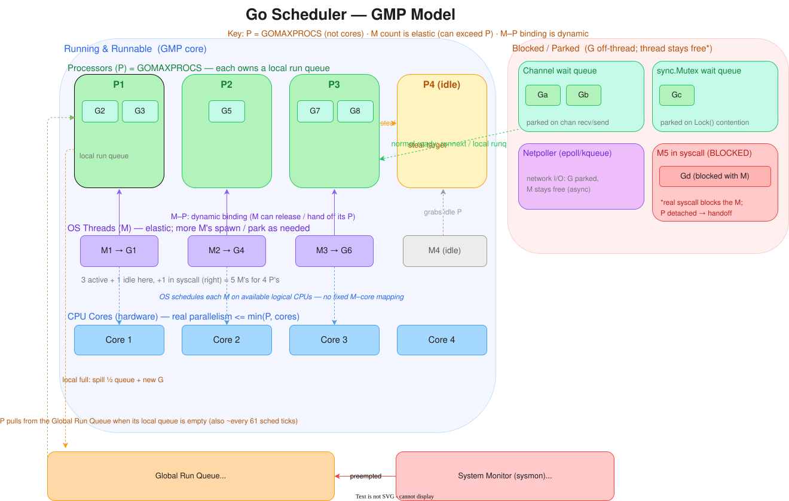
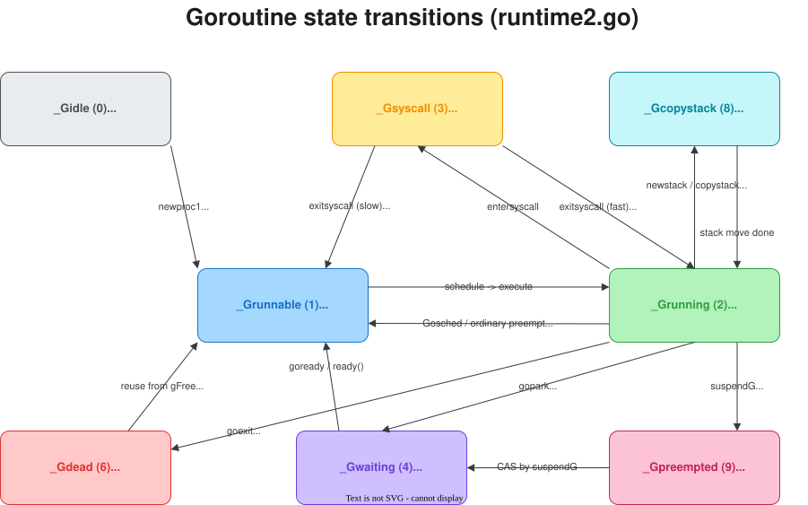
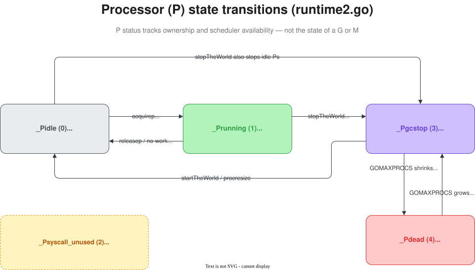

> Note: This article describes the runtime at Go 1.26.
> These internal details are not part of Go's compatibility guarantee.

## Goals of the Go Runtime Scheduler
- Minimize OS thread overhead (context switch, resource usage)
- Support high concurrency
- Scale across CPU cores for true parallelism
- Ensure fairness among tasks (best-effort)

## Architecture
The scheduler isn't a single runtime component. It's a collection of algorithms and data structures that coordinate goroutines, OS threads, processors, timers, network polling, and runtime work. Its general architecture is described in the diagram below.

From the diagram above, we have eight goroutines from G1 to G8 in local run queues and being executed by Ms, some goroutines (Ga, Gb, Gc) are waiting on channel/mutex, one (Gd) is blocked in a syscall. GOMAXPROCS = 4, but there are five machines, from M1 to M5, the M5 is blocked in a syscall. There are exactly four processors, from P1 to P4. Also notice that there are 4 vCPUs.

### G-M-P

#### The model
- A `G` represents a goroutine. It is lightweight thread, managed by the Go runtime in user space. It typically starts with a 2KiB stack that grows or shrinks dynamically.

- `P` is the logical processor. By itself it can't perform the work itself but it has necessary information and infrastructure to finish the work. The number of active `P` is strictly equal to `GOMAXPROCS`. Each `P` has a 256-slot local run queue and a `runnext` slot.

- An `M` represents an OS thread. The one that actually performs the work. Number of `M`s can be larger than `GOMAXPROCS`, but only at most `GOMAXPROCS` threads can hold `P`s and execute goroutine, the other must be inactive in pool, blocked by system calls/cgo or running runtime work.

#### `GOMAXPROCS` 
- The limit on simultaneous execution of Go code. On Linux, its default is set to the minimum number of vCPUs available through affinity and cgroup CPU limit. [Source](https://github.com/golang/go/blob/go1.26.4/src/runtime/cgroup_linux.go#L81-L119)
- Since the Go scheduler multiplexes a large number of `G`s onto a few `M`s, `M`s are expected to be busy most of the time. Setting `GOMAXPROCS` larger than the number of vCPU will not necessary increase the parallelism and may increase resource and context switch overhead instead.

#### The Bank Branch Analogy
- Imagine a bank branch with many customers, service counters, and bankers.
- Each customer represents a goroutine (`G`). A service counter represents a processor (`P`). Each service counter owns a local waiting line and equipment (computer, for example) required to serve customers. A banker represents the OS thread (`M`).
- A service counter must have a banker to be able to serve a customer. If there are four service counters, but six bankers, at most four bankers can serve customers simultaneously. The remaining bankers may be idle or occupied with work away from a counter. This is similar to a Go program with four Ps but more than four Ms.
- Customers are assigned to service-counter queues. If a counter queue is empty, it may take customers from the shared lobby queue, or from another counter's queue. This corresponds to the global run queue and work stealing.
- Sometimes a customer must wait for information from another department. If the request can be handled asynchronously, the customer steps in the waiting area while the banker serves someone else. When the information arrives, the customer becomes ready again and returns to a runnable queue. This resembles a goroutine parking while waiting for a channel, mutex, timer, or network operation.
- Other requests require the banker to leave the counter and perform blocking work elsewhere. In that case, the banker and current customer leave together. The service counter, its equipment, and its remaining customers stay behind, so another idle or newly hired banker can take over the counter. This resembles an M blocking in a syscall while its P is detached or retaken and assigned to another M.

| Bank | Go runtime |
|---|---|
| Customer/request | G |
| Service counter, local line, and equipment | P |
| Banker | M |
| Number of counters | `GOMAXPROCS` |
| Counter’s waiting line | Local run queue |
| Priority card for the next customer | `runnext` |
| Shared lobby line | Global run queue |
| Waiting area | Channel, timer, or netpoll wait queue |
| Banker taking customers from another line | Work stealing |

### The network poller (netpoll)
- When a `G` performs a read or write (`conn.Read`) on a pollable file descriptor, if the kernel say `EAGAIN` (no data yet). Instead of allowing `G` to blocks its `M`, a reference to `G` is stored in `pollDesc` and `G` is parked, `M` is now free and can handle other `G`s. Later, when the file descriptor is ready, the scheduler will wake the corresponding `G` and make it runnable. `G` resumes inside the read/write, retries the syscall.
- The purpose is to help programmers still write simple I/O blocking code, but underneath it can handle using non-blocking I/O.
- Pollability is OS dependent. On Linux, sockets, pipes, TTYs, eventfds, inotify fds,... are pollable, while regular files are not pollable.
- When the file descriptor is not pollable, an operation that blocks also blocks its `M`.

### System monitor (sysmon)
- Sysmon is a background monitoring routine. It run with its own os thread (`M`), and without a `P`. Its job is to do housekeeping that keep schedulers and runtime healthy.
- Its running interval is adaptable, as short as ~20µs when things are busy, up to and can exceed 10ms when idle
- It helps retake `P` from a blocked `M` (`_Gsyscall`). When a goroutine makes an ordinary syscall, the runtime optimistically leaves the `P` associated with the blocked `M`. If the syscall remains in progress and the `P` is useful elsewhere, sysmon can take the `P` from that `M` and hand it to another `M`. For a syscall known to block, `entersyscallblock` hands off the `P` before entering the syscall.
- Preempting the long-running goroutine (`_Grunning`). Sysmon checks for `G` that have run on a `P` for too long and flags them for preemption so they don't starve other goroutines in `P`. 
- Polling the network: if the netpoll hasn't run for a while, sysmon will call it to find those goroutines whose I/O has completed and make them runnable again. The scheduler also calls netpoll in other places, this is a backstop.
- Forcing GC: if GC hasn't run for about two minutes (`forcegcperiod`), sysmon will force one.

## How does it work?
### How runnable work is found
How does an `M` that owns a `P` find the next runnable goroutine to execute? The steps below are executed sequentially for each scheduling `M`:

**Note that these steps are simplified version of findRunnable**

0. Global fairness check: Approximately every 61 scheduling ticks, the scheduler checks the global run queue before its local run queue. Otherwise, the goroutines that continuously populate the local queue could starve the globally queued goroutines. (`schedtick % 61 == 0`)
1. `runnext` slot: besides the local run queue, each `P` has a single `runnext` slot.
2. Local run queue: if `runnext` is empty, `P` takes next goroutine from its local ring buffer. This queue has 256 slots and is owned by one `P` therefore avoid global scheduler lock, work stealing still requires atomic coordination with other `P`s. The `G`'s data may still be cached in the current CPU's cache.
3. Global run queue: if local run queue is empty, it will move a batch of goroutines from global run queue to local run queue. Moving a batch amortizes the cost of acquiring the global scheduler lock.
4. Netpoll: if the local run queue has no work, the scheduler will check the netpoll for I/O-ready goroutines. When netpoll returns a list of goroutines, one will be executed directly, the remaining are injected into the local run queue, possibly to global run queue also if local queue is full.
5. Work stealing: if netpoll has no work, the P tries to steal from another P. It steals about half of the goroutines in the victim's local run queue.

**Scheduling tick**: `schedtick` is incremented every time a G gets a new time slice. `runnext` G inherits the existing time slice.

Source: [findRunnable()](https://github.com/golang/go/blob/go1.26.4/src/runtime/proc.go)

## A Goroutine's life cycle

### Goroutine state transitions

`_Gcopystack` and `_Gpreempted` are transient/internal, they are included to the diagram for the sake of completeness. Some states are excluded from this diagram as they don't have much value. For the complete list of states, [refer to](https://github.com/golang/go/blob/go1.26.4/src/runtime/runtime2.go#L17-L120).

Some state transitions will be described in more detail below:

**Gidle/Gdead → Grunnable (creation)**

new G: _Gidle → _Gdead → _Grunnable
reused G: _Gdead → _Grunnable

- A goroutine is created when the program executes `go some_func()`. The runtime calls `newproc`/`newproc1`, it allocates a new G or reuse from a pool, initialize its stack and execution context, and changes its state to `_Grunnable`. G is then submitted to `runnext`/local run queue/global run queue on overflow. [newproc](https://github.com/golang/go/blob/go1.26.4/src/runtime/proc.go#L5292-L5307)

- The creation of a goroutine doesn't mean it will be executed immediately; it will be scheduled by the scheduler.

**Grunnable → Grunning**
- selected by scheduler and start to execute

**Grunning → Gwaiting (park)**
- Goroutine (`G`) parking means, the goroutine encounters a resource that is currently busy or it cannot continue immediately. `G` now must detach from the `M` and go to sleep until the resource is available again. [gopark](https://github.com/golang/go/blob/go1.26.4/src/runtime/proc.go#L445-L479) [park_m](https://github.com/golang/go/blob/go1.26.4/src/runtime/proc.go#L4252-L4305)
- After goroutine is parked, `M` is detached from `G`, the OS thread (`M`) now is free to execute another goroutine in its local run queue.
- A goroutine can park on these resources: channel, mutex, sync.Cond, fdMutex, (pollable fd) netpoll, timer.

| Component | Description | Code |
| ---------- | ----------- | --------- |
| Mutex, RWMutex, WaitGroup, fdMutex | `semtable` | `sudog` based, treap: sema.go |
| sync.Cond | `notifyList` | `sudog` based, FIFO list: sema.go |
| Channel | `hchan` `waitq` | `sudog` based, FIFO list: chan.go |
| time.sleep/after/deadline | per-P timer | timer based, min heap: time.go |
| netpoll | `pollDesc` rg/wg | raw `g`, single slot: netpoll.go |

**Gwaiting → Grunnable (wake)**

- When a goroutine makes a parkable resource available, it will wake one or more of those goroutines waiting on the resource. Note that timers, network readiness, deadlines, and runtime operations can also wake `G`s. [goready](http://github.com/golang/go/blob/go1.26.4/src/runtime/proc.go#L481-L485)
- The `goready`/`ready` prefers to land in the `runnext` slot of the current `P`, falling back to local run queue and then global run queue. Batch wake-up paths such as netpoll use a different queue-injection logic.
- If the local run queue is full, `runqputslow` will move half of the existing Gs and the newly submitted G to the global run queue.

**Grunning → Gsyscall (enter syscall)**
- [Source](https://github.com/golang/go/blob/go1.26.4/src/runtime/proc.go#L4603-L4861)
When a `G` makes a syscall, one of the following paths can happen:
- Just wait until the syscall is finished. The runtime is optimistic that the syscall will finish quickly. [reentersyscall](https://github.com/golang/go/blob/go1.26.4/src/runtime/proc.go#L4627-L4715). In this path, if the syscall lasts long enough, sysmon can retake the `P` so another `M` can run its queued goroutines.
- Blocking syscall: if Go knows the syscall will block, it will release the `P` and call `handoffp`, which will wake or start another `M` to run it, this minimizes `P`'s idle time. [entersyscallblock](https://github.com/golang/go/blob/go1.26.4/src/runtime/proc.go#L4791-L4861)

**Gsyscall → Grunning (fast path) → Grunnable (slow path)**
- When the syscall return, [exitsyscall](https://github.com/golang/go/blob/go1.26.4/src/runtime/proc.go#L4883-L5015) changes the `G`'s status from Gsyscall to Grunning. If the `M` still has its `P`, it will just continue to execute immediately. Otherwise it will find another idle `P` to execute. This is the fast path.

- If no `P` can be acquired, [exitsyscallNoP](https://github.com/golang/go/blob/go1.26.4/src/runtime/proc.go#L5061-L5105) changes `G`'s status from `Grunning` to `Grunnable`. It will then try to acquire an idle `P` again, if successful, it executes `G` with that `P`. Otherwise, it will put `G` on the global run queue, `M` parks. This is the slow path.

**Grunning → Grunnable (preemption)**

- CPU-bound means a task that requires intensive CPU resources such as encryption, decryption, compression.
- If a goroutine that runs a CPU-bound task, it can monopolize the OS thread (`M` and `P`), block other goroutines in the queue.
- Sysmon periodically samples each `P`. If its `schedtick` has remained unchanged for at least `forcePreemptNS` - currently 10 ms - it requests best-effort preemption of the running goroutine or `runnext` chain. [retake](https://github.com/golang/go/blob/go1.26.4/src/runtime/proc.go#L6626-L6671). Since Go 1.14 on Unix, sysmon triggers an asynchronous preemption by sending a signal `SIGURG` to the OS thread, which can even interrupt a call-free loop.
- The preempted goroutine will be put on the global run queue.

**Grunning → Gdead**
- The function returns and `goexit0` recycles the G.

**Grunning → Gpreempted**

- This transition is rare and sounds a bit misleading at first. The ordinary scheduler preemption is `Grunning → Grunnable`.
- It is used by [`suspendG`](https://github.com/golang/go/blob/go1.26.4/src/runtime/preempt.go#L193-L235) when another runtime operation, such as stack scanning or profiling, needs to suspend and take responsibility for the goroutine.

### Processor states

| State | Description |
| ----- | ----------- |
| _Pidle | _Pidle means a P is not being used to run user code or the scheduler. Typically, it's on the idle P list and available to the scheduler, but it may just be transitioning between other states. The P is owned by the idle list or by whatever is transitioning its state. Its run queue is empty. |
| _Prunning | _Prunning means a P is owned by an M and is being used to run user code or the scheduler. Only the M that owns this P is allowed to change the P's status from _Prunning. The M may transition the P to _Pidle (if it has no more work to do), or _Pgcstop (to halt for the GC). The M may also hand ownership of the P off directly to another M (for example, to schedule a locked G). |
| _Psyscall_unused | _Psyscall_unused is a now-defunct state for a P. A P is identified as "in a system call" by looking at the goroutine's state. |
| _Pgcstop | _Pgcstop means a P is halted for STW and owned by the M that stopped the world. The M that stopped the world continues to use its P, even in _Pgcstop. Transitioning from _Prunning to _Pgcstop causes an M to release its P and park. The P retains its run queue and startTheWorld will restart the scheduler on Ps with non-empty run queues. |
| _Pdead | _Pdead means a P is no longer used (GOMAXPROCS shrank). We reuse Ps if GOMAXPROCS increases. A dead P is mostly stripped of its resources, though a few things remain (e.g., trace buffers).|

### Processor state transition

## Conclusion
Go achieves concurrency by multiplexing many small, growable goroutines over fewer OS threads. Goroutine parking allows an M and P to run other work, while syscall handoff prevents a blocked M from monopolizing a P. `GOMAXPROCS` limits simultaneous Go execution. Local run queues, work stealing, global fairness checks, and best-effort preemption help distribute work fairly.
