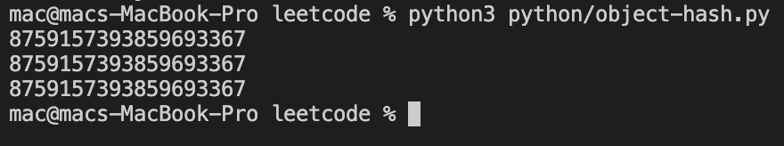
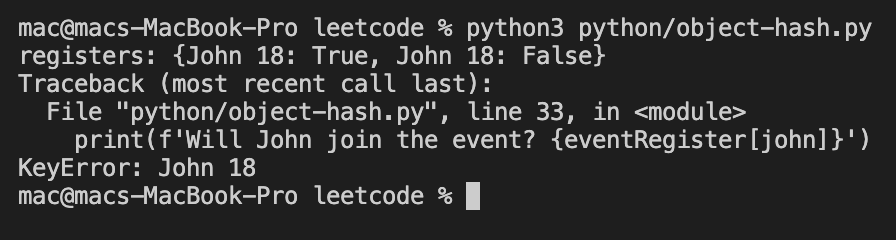
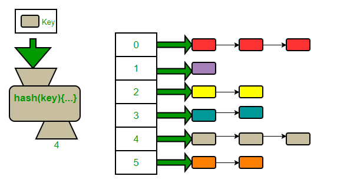
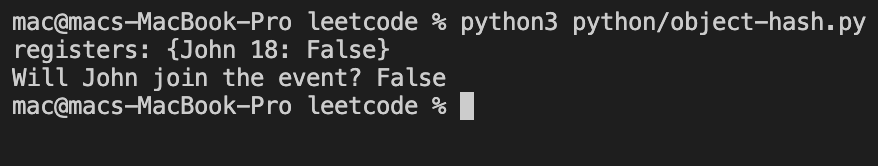

To demonstrate what is the difference between object hash code and object equal, I would like to start with a simple example in Python.
```python
class Person:
    def __init__(self, name: str, age: int) -> None:
        self.name = name
        self.age = age

    def __repr__(self) -> str:
        return f'{self.name} {self.age}'
            
    
john = Person('John', 18)

eventRegister = {}

# John want to join the event
eventRegister[john] = True

# In the next day,
# he changes his mind

john = Person('John', 18)

eventRegister[john] = False

print(f'registers: {eventRegister}')


# Check
john = Person('John', 18)

print(f'Will John join the event? {eventRegister[john]}')
```
It’s quite simple, right? I define a new Person class that has two properties age and name. And then I defined a map, to check if a person join the event or not.

So I have a person named John, at first he join, but the next day he change his mind and don’t want to join the event anymore because he got a ton of home need to finish 🤕. So my expectation here is when I check if John joins the event, the result should be False.

Let’s see how it goes!


So on the map, you can see two records with the same values of name and age. The first record is for the time John registered for the event, the second one is the time John withdraw from the event. That is not correct, I expect that there should be only one record in the map representing John.

And lastly, I want to check if John join the event by accessing the map, it doesn’t even know who is John :’)

Haha, but I am a good student, I work very hard at university, these problems can’t trouble me :D. I remember that in a hash map before putting a pair of keys and values in, it will hash the key to getting a number to find the position of the bucket in the map for this key. So every pair have the same hash will go into the same bucket.

So let’s see the hash values of these John objects.

```python
john = Person('John', 18)
print(john.__hash__())
john = Person('John', 18)
print(john.__hash__())
john = Person('John', 18)
print(john.__hash__())
```
Let’s see how it goes!


Exactly what I expected, despite three John objects all having the same values in their properties, they have different hash values, so they will consider as different objects, and will be put in different buckets on the map.

So what is the solution? Haha 😂 pretty simple, I only need to override the hash function of the Person class, so every Person object with the same values in their properties will have the same hash.

```python
class Person:
    def __init__(self, name: str, age: int) -> None:
        self.name = name
        self.age = age

    def __repr__(self) -> str:
        return f'{self.name} {self.age}'
    
    def __hash__(self) -> int:
        return hash((self.name, self.age))
```

```python
john = Person('John', 18)
print(john.__hash__())
john = Person('John', 18)
print(john.__hash__())
john = Person('John', 18)
print(john.__hash__())
```

So three John objects with the same values in their properties have the same hash value now. So my first code snippet should work now, haha

oops 😬 what wrong?\
After an hour of searching on the internet, I just remember how a hash map works.

I guess, in Python hashmap, they use chaining as a method to handle hashing collision 💥. Hashing collision happens when two different keys have the same hash. In the chaining method, each bucket in the hash map does not contain a pair but a list of pairs. So every pair whose key has the same hash value will be appended to that list.

The problem here is, how do you know if your pair (key, value) has been already on the list or not? Pretty simple, using `__eq__` function to compare objects, we will iterate through every pair in the list and compare it to the new pair, if the new pair haven’t been in the list, we append it to the list. So the next thing we need to do is to override the `__eq__` function.

```python
class Person:
    def __init__(self, name: str, age: int) -> None:
        self.name = name
        self.age = age

    def __repr__(self) -> str:
        return f'{self.name} {self.age}'
    
    def __hash__(self) -> int:
        return hash((self.name, self.age))

    def __eq__(self, __o: object) -> bool:
        return self.age == __o.age and self.name == __o.name 
```

Everything work now hahaha 🤣🤣🤣 hard work payoff.

## References
https://www.geeksforgeeks.org/implementing-our-own-hash-table-with-separate-chaining-in-java/
