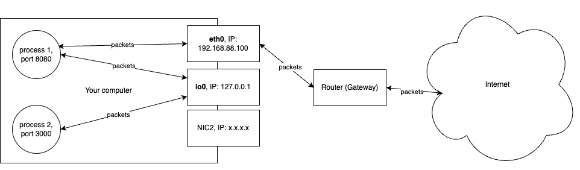
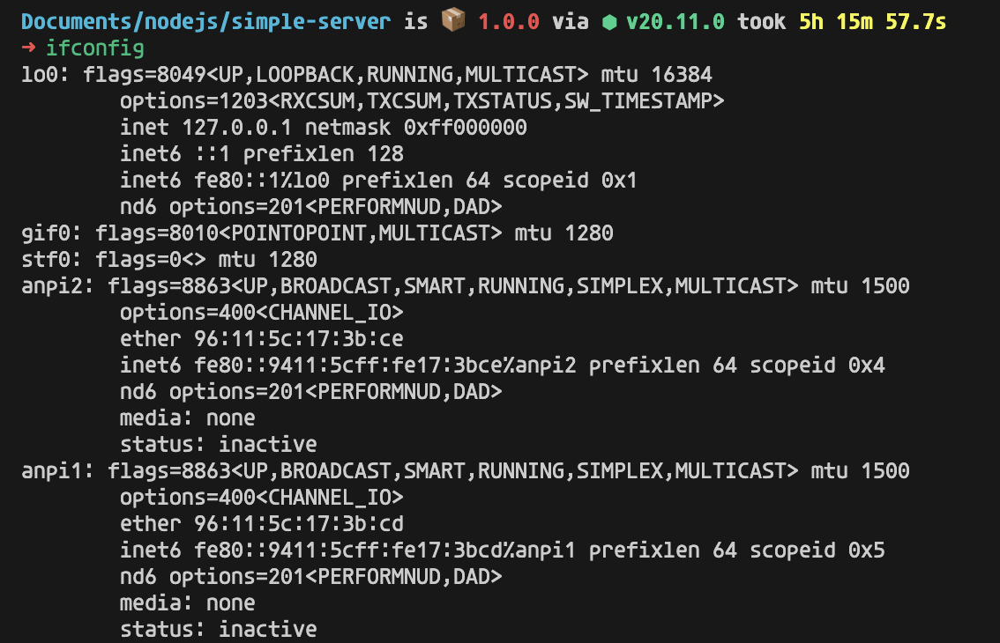
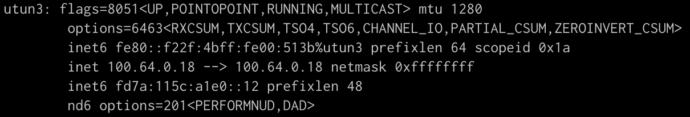

Have you ever asked, why do we usually listen on localhost:8080 during development process, can we listen on Google IP instead of localhost?

I have a little code snippet written in NodeJS:
```js
var http = require('http');
http.createServer(function (req, res) {
res.writeHead(200, {'Content-Type': 'text/plain'});
res.end('Hello World\n');
}).listen(8080, 'localhost');
```
It doesn’t do anything complex, just starts a new server, listens on localhost:8080, and responds ‘Hello World’ to requests.

I need you to do a little more thing, open your terminal, and execute this command (MacOS or Linux) to get your local IP:
```sh
ifconfig
```
It will return a bunch of text, on MacOS you find the thing named `en0`, on Linux, it’s `eth0`.
```sh
en0: flags=8863<UP,BROADCAST,SMART,RUNNING,SIMPLEX,MULTICAST> mtu 1500
    options=6463<RXCSUM,TXCSUM,TSO4,TSO6,CHANNEL_IO,PARTIAL_CSUM,ZEROINVERT_CSUM>
    ether f0:2f:4b:00:51:3b
    inet6 fe80::10b4:597a:41fc:be11%en0 prefixlen 64 secured scopeid 0xe
    inet 192.168.88.103 netmask 0xffffff00 broadcast 192.168.88.255
    nd6 options=201<PERFORMNUD,DAD>
    media: autoselect
    status: active
```
The local IP address is the address after the word `inet`, my local IP address is `192.168.88.103`, your local IP address should have the format `192.168.x.x`

Ok, we have a running NodeJS server and your local IP address. Now try to access the server by entering `localhost:8080` to your browser. It works fine, right? You should see the string `Hello World` on the screen.

After that try to access the server with your local IP address, in my case `192.168.88.103:8080`. Your browser can’t access it, right?

Let’s modify the code snippet a little bit, and replace localhost with your local IP address, the code now looks like this:
```js
var http = require('http');
http.createServer(function (req, res) {
  res.writeHead(200, {'Content-Type': 'text/plain'});
  res.end('Hello World\n');
}).listen(8080, '192.168.88.103');
```
Now you can’t access the server with the address `localhost:8080`, but you can with the address `192.168.88.103:8080`. It’s weird, isn’t it?

Now, replace your local IP with `0.0.0.0`, and the code will look like this:
```js
var http = require('http');
http.createServer(function (req, res) {
  res.writeHead(200, {'Content-Type': 'text/plain'});
  res.end('Hello World\n');
}).listen(8080, '0.0.0.0');
```
Try accessing your server with `localhost:8080` and your local IP, in my case, `192.168.88.103:8080`. You can access your server with both addresses, right? And I will explain what happened in this post.

## Network Interface Card – NIC
If you are a computer science graduate, you probably heard about this `NIC` thing. Basically, it is an interface that stands between your computer and the internet, requests and responses from/to your computer will need to go through `NIC`.

People usually say, my computer’s IP address is `198.168.x.x`. But it’s not completely true, your computer doesn’t have an `IP`, `NIC` has an `IP`, and your computer can have many NICs.

an oversimplified diagram, networking is more complex than this 😅


On Mac or Linux, you can see a list of NICs by executing the command of `ifconfig` in the terminal. There are quite a lot of NICs (most of them are inactive), some of them are virtual, and some of them are created by `VPN`, in the extent of this post, we only consider some mostly used NICs.


a long list of NICs

## Routing table
We already know that on our computer, there is usually more than one NIC and our requests have to go through NIC, how do we know which specific NIC our requests go in? The answer is the `routing table`, it has rules to specify which NIC a request goes into. You can execute the command `netstat -rn` to see the table
```sh
➜ netstat -rn
Routing tables
 
Internet:
Destination        Gateway            Flags           Netif Expire
default            192.168.88.1       UGScg             en0
127                127.0.0.1          UCS               lo0
127.0.0.1          127.0.0.1          UH                lo0
169.254            link#14            UCS               en0      !
192.168.88         link#14            UCS               en0      !
192.168.88.1/32    link#14            UCS               en0      !
```
The routing table is quite lengthy, here we only consider some popular records.

The OS will match the target IP in your requests with the IPs in column **Destination**, the route (NIC) with the *longest matching prefix* will be selected.

For example, if you send requests to `127.0.0.1`, the third route, corresponding to the `lo0` (loopback) interface will be selected. The result is your requests will be forwarded to `lo0` NIC.

The `default` (aka 0.0.0.0) destination in the table, if none of the other destination IPs matches your request’s target IP, your request will be sent to the `default` route or `en0` NIC.

`localhost` is actually just a DNS mapping, `localhost` will be translated to `127.0.0.1`. you can check it by executing the command `cat /etc/hosts`
```sh
➜ cat /etc/hosts
##
# Host Database
#
# localhost is used to configure the loopback interface
# when the system is booting.  Do not change this entry.
##
127.0.0.1   localhost
255.255.255.255 broadcasthost
::1             localhost
```

## `lo0` – Loopback
If your server listens on `localhost:8080`, it means the server listens on the *loopback interface* (lo0), any requests that are sent to the loopback (localhost) interface with port 8080 will be forwarded to your server.

In the earlier example, if you try to access with the *local IP address* (in my case: 192.168.88.103:8080), your request will be forwarded to `en0` (or `eth0`), a different NIC to which your server is listening. that’s why you can’t access the server with the *local IP address* (192.168.88.103:8080) while your server is running on `localhost:8080`.

Loopback is a special interface to help your computer communicate with itself. When you send a request to the loopback interface, it will never leave your computer. And when your server listens on the loopback interface, no other computers in your local network can access the server.

## `en0` or `eth0` – Ethernet
Similar to the `lo0`, when your server listens on your *local IP* (192.168.88.103:8080), it listens on the `en0` (or `eth0`) NIC. When opening a tab on your browser with the address `localhost:8080`, the request will be forwarded to the loopback interface (`lo0`), your request then can’t be forwarded to your server.

One great thing about listening on your local IP address is you now can access your server from other computers, as long as those computers are in the same local network (LAN) with you.

## 0.0.0.0 – All NICs

When your server listens on `0.0.0.0:8080`, it means that your server listens on all available NICs on your computer, so you can access your server using the IP of any NIC.

That’s why you can access your server with `localhost:8080` or your *local IP* when your server is running on `0.0.0.0:8080`.

You can just grab the IP of any NIC on your computer, and access your service. For example, there is a NIC named `utun3` on my computer, I don’t know what is it (this NIC might be created by the VPN), but its IP is `100.64.0.18`.


So I open a browser tab with the address `100.64.0.18:8080`, and it shows the ‘Hello World’ string on the screen.

Listen on `0.0.0.0` is usually considered as bad practice, you can read more about it [here](https://superuser.com/questions/1013740/is-it-bad-practice-to-listen-on-0-0-0-0-why).

## Hostname of the server when using a backend framework like Spring Boot or ExpressJS
A simple server using ExpressJS would go like this:
```js
const express = require('express')
const app = express()
const port = 3000
 
app.get('/', (req, res) => {
  res.send('Hello World!')
})
 
app.listen(port, () => {
  console.log(`Example app listening on port ${port}`)
})
```
You don’t know whether the server listens on localhost or local IP, right? Defaultly, the framework will create a server listening on 0.0.0.0.

If you are using a framework and worder which NIC your server listening on, you can use the command `netstat -an` on Mac:
```sh
➜ netstat -an | grep 3000 | grep LISTEN
 
tcp46      0      0  *.3000                 *.*                    LISTEN
```
The `*` as in `*.3000` mean the ExpressJS server listen on all NICs.

You can choose which host (NIC) to listen on, by modify the code as below:
```js
const express = require('express')
const app = express()
const port = 3000
const host = 'localhost'
  
app.get('/', (req, res) => {
  res.send('Hello World!')
})
  
app.listen(port, host, () => {
  console.log(`Example app listening on port ${port}`)
})
```
Check the NIC
```sh
➜ netstat -an | grep 3000 | grep LISTEN
 
tcp6       0      0  ::1.3000               *.*                    LISTEN
```
`::1` as in `::1.3000` is the IPv6 of the loopback interface

## Key takeaways
If your server listens on:
- `localhost:8080`, it listens on the loopback NIC (`lo0`)
- `local IP address` (`192.168.x.x`), it listens on the Ethernet NIC (`en0`, or `eth0`)
- `0.0.0.0:8080`, it listens on all available NICs

your computer has a long list of NICs\
your server can listen on IP of any NIC in your computer
