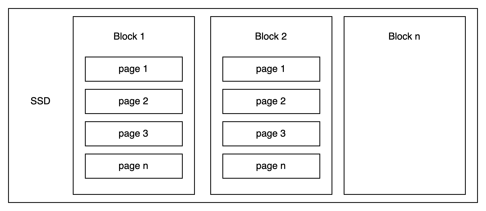

## HDD
Two important components that make up an HDD are a rapidly rotating platter and a movable magnetic head.
The magnetic disk are divided into concentric circles called tracks. Each track is divided into equal smaller parts called sectors. 
Each sector is usually 512 bytes in size, and it is also the minimum unit of read and write operation. That means that even you only need to write or read a few bytes, the system must read the entire 512 bytes sector.
To read or write any sector, the magnetic head must move to the track that contains the sector, and the platter must rotate to position the sector under the magnetic head.

- **A** is a track
- **C** is a sector

**Consequences:**
1. Read and write speed is depended on rotating speed of the platter and and moving speed of the magnetic head.
2. Sequential access will be more efficient than random access. Because it saves the time needed to rotate the platter and move the head.
    - **Fragmentation** occurs when related data is scattered across non-continuous tracks and sectors, making data access slower.
    - **Defragmentation** is the process of reorganize fragmented data so that related track are placed close to each other.

## SSD
SSD uses NAND flash memory to store data.
It is divided into blocks, each block is further divided into pages. A block usually have 128-256 pages, and a page is usually 4-8 KB in size.
A page is the minimum unit for reading and writing, while a block is the minimum unit for erasing.

**Important characteristics:**
- SSDs cannot overwrite new data directly on a page which already contains infomation. To update a page, you must find an empty page and write updated data there. The old page will be marked as dirty and erased later.
- SSDs can only delete data at block level (not individual page).
- Sequential access is still slightly faster than random access due to controller optimization.

**Consequences**:
- Wear leveling: Ech page has a limited number of earase/write cycles. Once exceeds this number, it can be broken and will not function. Wear leveling distributes writes to pages evenly, helping extend the life span of pages.
- Garbage collection: Since we can only write to clean (erased) pages, SSDs perform garbage collection to clean dirty pages by erase them. SSDs select a block with many dirty pages, move valid pages to other block, then erase all pages in selected block.
- Write amplification: This occurs when the amount of write operation performed on disk is greater than the amount of write operation the user requested, often due to the additional writes result from the Garbage Collector.
- Write coalescing: SSDs combime many small write requests into batches and write it to continuous pages, reducing erase/write cycle. SSDs also include volatile memory (similar to RAM), and backup power to protect data in the volatile memory in case of a power failure.

## Comparing

| Criteria                        | HDD                                       | SSD                                                       |
| :------------------------------ | :---------------------------------------- | :-------------------------------------------------------- |
| **Storage mechanism**           | Magnetic material                         | Flash NAND memory cell                                    |
| **Speed**                       | Slow, depends on rotation and seek time   | Fast, due to no mechanical part                           |
| **Latency**                     | Hight, especially for random access       | Low                                                       |
| **Durability (write endurance)**| Hight                                     | Limited number of erase/write cycles per page             |
| **Overwrite**                   | Can overwrite on existing data            | **Can't overwrite directly** (must erase first)           |
| **Write Amplification**         | Negligible                                | **Significant**: due to garbage collector                 |
| **Garbage Collection**          | Not required                              | **Required** to clean up dirty pages                      |
| **Wear leveling**               | Not required                              | **Required** evenly distribute writes to expand the life span|