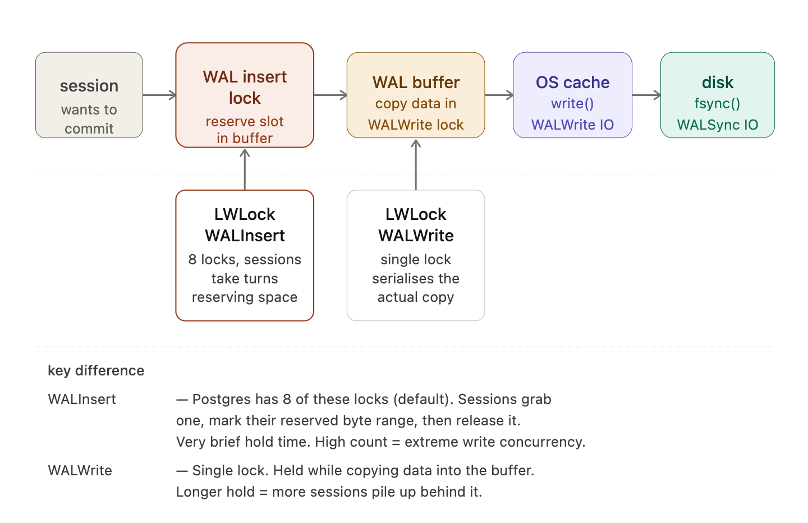

## TL;DR

- The optimal number of connections varies per workload and hardware. This benchmark observes how throughput, latency, and wait events change as connection count grows — it does not prescribe a universal number.
- $\text{core count} \times 2$ is a widely cited starting heuristic from the [PostgreSQL wiki](https://wiki.postgresql.org/wiki/Number_Of_Database_Connections). Use it as a starting point, then tune upward until TPS plateaus and latency variance grows.

## 1. Problem Statement

How many Postgres connections should I open? Should I open as many as possible?

## 2. Quick Background

There is a famous theorem in queueing theory called Little's Law. The formula is:
$$L=\lambda W$$
- $L$ is the long-term average number of requests
- $\lambda$ is the long-term average effective arrival rate
- $W$ is the average time that a request spends in the system

Assume I design a system that handles at most 1000 QPS (arrival rate), and each query takes 0.05 seconds on average to finish. Applying this theorem, $1000 \times 0.05 = 50$. That means at any second, there will be 50 queries in my database. Each query needs a connection, so I should open at least 50 connections; otherwise, queries will queue for a connection.

But that's the number of connections I need, not the number of connections I can open on a Postgres instance.

In Postgres, there is a config named `max_connections` that defines the maximum number of connections you can create. The default is 100, but it also varies by platform and instance size.

So if the maximum number of connections I can open on a Postgres instance is typically larger than what I need, why not just open all the connections I need, or even the maximum number of connections?

In Postgres, one client connection maps to one backend process. The more connections we open, the more context switching happens, and process context switching is much more expensive than thread switching. More backend processes can improve concurrency up to a point. Too many processes increase context switching and can hurt throughput and latency. Each connection only takes a few MB of RAM; the real cost is process context switching, which can cause CPU thrashing.

To reduce context switching, we need to take CPU count into account:
$$\text{connections} = (\text{core count} \times 2) + \text{effective spindle count}$$
- $\text{core count}$ should not include HT threads, even if hyperthreading is enabled
- $\text{effective spindle count}$ (the number of physical rotating disk spindles; zero when data is fully cached in memory) is zero if the active data set is fully cached, and approaches the actual number of spindles as the cache hit rate falls.

Reference: [Number Of Database Connections](https://wiki.postgresql.org/wiki/Number_Of_Database_Connections)

In this benchmark, I start with two connections (equal to the number of vCPUs) and keep increasing until TPS plateaus.

## 3. Benchmark Goal and Scope

### Goal

Observe how TPS, latency, and wait events change as connection count increases on this specific workload and hardware. The goal is not to find a universal optimal connection count — that depends on your workload, hardware, and access patterns — but to understand how Postgres behaves as concurrency grows.

### In Scope

- Connection count tuning for this specific workload.
- Database and OS observations.

### Out of Scope

- Other hardware classes.
- Other database engines.
- Full cost/performance analysis.

## 4. Environment

- Postgres version: 18
- Load generator: pgbench on EC2 `t3.micro` 2 vCPU, 1GB RAM
- Database: RDS `db.t4g.micro` 2 vCPU, 1GB RAM, 20GB storage, 90MB shared buffer
- Region/AZ: ap-southeast-2

## 5. Workload Design (E-wallet)

### Tables

- `users(id, name)`
- `wallets(id, user_id, balance, updated_at)`
- `transactions(id, idempotency_key, amount, status, created_at)`
- `ledger_entries(id, transaction_id, wallet_id, amount, direction, created_at)`

### Operation Mix

1. Transfer between two random users (weight 60%)
2. Get balance of a random user (weight 25%)
3. Get history of a random user (weight 15%)

Each script file is assigned a weight (sum = 100%), which determines the probability that it will be executed. A higher weight means a higher chance of execution.

These operations are performed against random users rather than following a Zipf distribution. In this benchmark, I want to focus on how Postgres behaves when the connection count changes, not on simulating a real e-wallet workload.

## 6. Dataset and Seeding

### Seeded Data Size

| Table Name | Table Size | Indexes Size | Total Size |
|------------|-----------|--------------|------------|
| ledger_entries | 15 MB | 10040 kB | 24 MB |
| transactions | 7480 kB | 2208 kB | 9728 kB |
| wallets | 592 kB | 480 kB | 1104 kB |
| users | 512 kB | 240 kB | 792 kB |


### Data Assumptions

- The seeded data fits in `shared_buffers` (90 MB), resulting in a very high shared buffer hit rate (>> 99%).
- Seeded data in `transactions` and `ledger_entries` is also random rather than following a distribution like Zipf.

## 7. Methodology

- Tool: pgbench with command: `pgbench -c <conn_count> -j 2 -T 180 --no-vacuum --protocol=prepared --progress=10`
- Connection counts tested: 2, 4, 8, 16, 32
- Duration per run: 180 seconds
- Threads (jobs): 2
- Warm-up time: 0 seconds (connection setup time is < 1 second)
- Repetitions per config: 1
- Mode: Prepared statements, no VACUUM between runs
- Metrics collected: TPS, average latency, latency stddev
- System metrics collected: CPU, load average, DB waits (`pg_stat_activity`), disk, network

During the benchmark, I capture a snapshot of `pg_stat_activity` every 10 seconds. For a 180-second run, this produces about 18 snapshots. I then store those snapshots in a local SQLite collector database for analysis.

The snapshot table (`snap_pg_stat_activity`) is structured with these field groups:

- Run metadata: `_id`, `_run_id`, `_collected_at`, `_phase` (pre, bench, post)
- Session identity: `pid`, `leader_pid`, `datid`, `datname`, `usesysid`, `usename`, `application_name`
- Client info: `client_addr`, `client_hostname`, `client_port`
- Timeline fields: `backend_start`, `xact_start`, `query_start`, `state_change`
- Wait and state fields: `wait_event_type`, `wait_event`, `state`
- Transaction/query fields: `backend_xid`, `backend_xmin`, `query_id`, `query`, `backend_type`

Besides `pg_stat_activity`, I also collect system metrics (CPU, disk, and network) at the same 10-second interval.

### Wait Profile Analysis

Wait events are aggregated with this query against the collector database:

```sql
SELECT
  COALESCE(wait_event_type, 'CPU') AS wait_event_type,
  COALESCE(wait_event, 'running')  AS wait_event,
  COUNT(*)                          AS occurrences,
  COUNT(DISTINCT _collected_at)     AS snapshot_count
FROM snap_pg_stat_activity
WHERE _run_id = ?
  AND _phase IN (...)     -- phase filter: 'bench', 'pre', 'post'
  AND state = 'active'
GROUP BY 1, 2
ORDER BY 3 DESC
LIMIT 20
```

**Average Active Session (AAS)** is total occurrences across all snapshots divided by the number of snapshots taken:

```js
const aas = snaps > 0 ? occ / snaps : 0;
```

For example: a 180-second run produces 18 snapshots (one every 10 seconds). If `CPU:Running` appears in 10 snapshots with a combined count of 20, AAS = 20 / 10 = 2. AAS can be compared directly to vCPU count as a utilization baseline.

> **Sampling note:** This samples `pg_stat_activity` every 10 seconds — the same methodology as CloudWatch AAS. Queries completing in milliseconds are rarely captured as `active`, so fast queries are underrepresented. Wait events for long-running or blocked sessions are detected reliably.

### How Noise Was Controlled

- Same instance type and settings for all runs.
- ANALYZE and CHECKPOINT after seeding
- These are burstable instances (cloud instance types that accumulate CPU credits during idle periods and spend them during bursts): I only benchmark when there are sufficient CPU and IO credits.
- For each config, the benchmark runs once, so the result is not fully protected from outliers.

### RDS Metric Limitations

Because the database runs on RDS (managed service), deeper OS-level metrics are not accessible:
- No direct access to kernel context switch counts or CPU scheduler metrics
- No access to `perf` profiling or flamegraphs
- No ability to observe page-level memory operations or cache misses
- Limited to RDS Enhanced Monitoring and Postgres `pg_stat_*` views

This means the high `CPU system` usage observed at c16+ is inferred scheduling overhead rather than directly measured context switching. A self-managed instance with `perf` or kernel tracing could provide definitive proof.

## 8. Benchmark 1 (Baseline)

### Configuration

PgBench runs on an EC2 instance and sends queries to RDS. Both are in the same network to ensure low network latency.

### Results

#### Data Summary

The benchmark with 2 connections is the baseline. The percentages represent changes compared to the baseline:

| Metric | c2 | c4 | c8 | c16 | c32 | Best |
|--------|-----|---------|-----------|-----------|-----------|------|
| TPS | 356.81 | 676.74 <br> +89.7% | 1357.28 <br> +280.4% | 2204.81 <br> +517.9% | 2421.58 <br> +578.7% | ▲ c32 |
| Avg Latency (ms) | 5.605 | 5.908 <br> +5.4% | 5.891 <br> +5.1% | 7.248 <br> +29.3% | 13.197 <br> +135.5% | ▲ c2 |
| Latency StdDev (ms) | 9.844 | 5.584 <br> -43.3% | 4.872 <br> -50.5% | 6.402 <br> -35.0% | 13.453 <br> +36.7% | ▲ c8 |
| Transactions | 64217 | 121777 <br> +89.6% | 244173 <br> +280.2% | 396443 <br> +517.3% | 434833 <br> +577.1% | ▲ c32 |

#### TPS vs Latency Trends



#### TPS vs Latency StdDev



### Observations

- From c2 to c16, doubling the connections also doubles TPS while latency stays fairly stable.
- From c16 to c32, doubling the connections increases TPS by only 10%, but doubles latency.
- This suggests that the sweet spot lies somewhere between 8 and 16 connections.

### System Insights

**Peak CPU**


CPU contention becomes apparent around 8 connections (`CPU total` = 72.2%). By 16+ connections, CPU is saturated with little headroom.

`CPU user` is database work. It doesn't increase much as connections increase (from 2.3% to 4.6% at peak). Meanwhile, `CPU system` (time spent on OS work — system calls and scheduler overhead) rises from 5.9% to 25.6%, the clearest signal of growing OS-level overhead as more backend processes compete for CPU. `CPU Nice` (time spent running processes at a lowered OS priority) grows the most, from 7.2% to 54.8%; on RDS, Postgres workers or management daemons may run at a non-zero nice value, so this reflects their increasing share of CPU time under load — it is not a direct measure of context switching.

**Peak Load Average: 1m (from RDS Enhanced Monitoring)**

Load average measures how many processes are waiting to use the CPU at any given time — both actively running AND waiting in queue (for CPU or I/O).
It is not a percentage. It's a raw count.



The load at c8 is 1.27 (we have 2 vCPUs), so at peak there are about 1.27 processes running or waiting for CPU. At this point, CPU is still underutilized.
The load at c16 is 5.55. At this point, we have overloaded the CPU.
This again suggests that the sweet spot is somewhere between 8 and 16 connections.

## 9. Analysis by Connection Count (Benchmark 1)

Wait profiles are derived from the snapshots and AAS metric described in §7 Methodology.

### c2 - Baseline
| Wait Type | Wait Event | Count | AAS |
|-----------|-----------|-------|-----|
| CPU | running | 21 | 1.17 |
| IO | WalSync | 3 | 1.00 |

The waiting profile looks good.
- The `CPU` wait is not actually a wait; it indicates processes are running. Our database instance has 2 vCPUs, so a CPU AAS of 1.17 means CPU is underutilized.
- `IO:WalSync` happens when a transaction waits for WAL buffer data to be physically flushed and acknowledged by disk.

### c4 - Low Concurrency
| Wait Type | Wait Event | Count | AAS |
|-----------|-----------|-------|-----|
| CPU | running | 24 | 1.33 |
| IO | WalSync | 2 | 1.00 |

Still fine. CPU is still underutilized.

### c8 - Moderate Concurrency
| Wait Type | Wait Event | Count | AAS |
|-----------|-----------|-------|-----|
| CPU | running | 24 | 1.33 |
| IO | WalSync | 13 | 1.00 |
| LWLock | WALWrite | 11 | 1.57 |
| Client | ClientRead | 1 | 1.00 |

Still fine.
- But notice there is a small amount of `Client:ClientRead` wait. This usually happens in an interactive multi-query transaction, where the server finishes processing the current query and waits for the next query from the client. This wait indicates network latency between the client and Postgres, or that the client can't keep up with Postgres.
- Postgres has a WAL buffer (`wal_buffers`) to batch many transaction commits together and perform one fsync (a system call that flushes dirty OS page cache data to durable storage). When a transaction commits, it needs to acquire a lightweight lock on this WAL buffer so it can write. `LWLock:WALWrite` indicates that many transactions are concurrently trying to write commit records to the WAL buffer.
- At this point, we are still underutilized.


### c16 - High Concurrency
| Wait Type | Wait Event | Count | AAS |
|-----------|-----------|-------|-----|
| LWLock | WALWrite | 27 | 2.08 |
| CPU | running | 22 | 1.22 |
| IO | WalSync | 14 | 1.00 |
| Client | ClientRead | 8 | 1.00 |
| Lock | transactionid | 2 | 1.00 |
| IO | WalWrite | 1 | 1.00 |

- AAS of `LWLock:WALWrite` is 2.08, higher than our vCPU count. This is unhealthy: it indicates that `LWLock:WALWrite` is overloaded, so adding more connections probably won't help.
- After a transaction writes to the WAL buffer successfully, it calls `write()` to copy WAL data to the OS page cache (the kernel's in-memory buffer for disk writes). `IO:WalWrite` is waiting for that `write()` call to return.

### c32 - Saturation Point
| Wait Type | Wait Event | Count | AAS |
|-----------|-----------|-------|-----|
| Client | ClientRead | 45 | 4.09 |
| CPU | running | 37 | 2.06 |
| LWLock | WALWrite | 25 | 2.78 |
| IO | WalSync | 12 | 1.00 |
| Lock | transactionid | 2 | 1.00 |
| LWLock | BufferContent | 1 | 1.00 |
| LWLock | WALInsert | 1 | 1.00 |

- AAS of `Client:ClientRead` is very high, around double our vCPU count. The client can't keep up with the server.
- `CPU:running` reaches the limit at `2.06`.
- `LWLock:WALWrite` is now worse than in the previous run.
- For `LWLock:WALInsert`, before a transaction can copy data into the WAL buffer, it must reserve a byte range protected by the WALInsert lock. Postgres has 8 of these locks by default, and each lock is held for a very short period. So if we observe this wait, more than 8 transactions are trying to acquire these locks, which indicates extreme write concurrency.

**Summarize of WAL lock**



## 10. Benchmark 2 (Pipeline Mode)
From Benchmark 1, at 32 connections the `ClientRead` wait is very high — the client is too slow, making transactions take longer to finish.

From Little's Law: $L=\lambda W$
Reducing $W$, the time a query (transaction) spends in the system, allows a higher throughput ($\lambda$) for the same concurrency level ($L$).

So I decided to use pipeline mode to remove this wait almost entirely. Instead of the Postgres server responding to one query and waiting for the next query from the client during a transaction, the client submits all queries in the transaction up front, and the server executes them without waiting between queries.

### What Changed
PgBench supports this out of the box. We just need to wrap the transaction with `\startpipeline` and `\endpipeline`.

### Result
| Metric | c2 | c4 | c8 | c16 | c32 | Best |
|--------|-----|---------|-----------|-----------|-----------|------|
| TPS | 1111.25 | 1941.22 <br> +74.7% | 3349.19 <br> +201.4% | 4558.39 <br> +310.2% | 4612.74 <br> +315.1% | ▲ c32 |
| Avg Latency (ms) | 1.799 | 2.059 <br> +14.5% | 2.383 <br> +32.5% | 3.502 <br> +94.7% | 6.920 <br> +284.7% | ▲ c2 |
| Latency StdDev (ms) | 1.086 | 1.561 <br> +43.7% | 2.108 <br> +94.1% | 5.027 <br> +362.9% | 8.483 <br> +681.1% | ▲ c2 |
| Transactions | 199997 | 349321 <br> +74.7% | 602441 <br> +201.2% | 819367 <br> +309.7% | 828214 <br> +314.1% | ▲ c32 |


TPS is roughly double compared to not using pipeline mode.





- From c16 to c32, doubling connections results in little TPS increase, while latency and latency stddev become very high. This means the system takes longer to process queries and response time is less stable.
- From c8 to c16, increasing connections does increase TPS, but we trade off higher latency and less stable response time.

**Peak CPU**



- CPU is saturated around c8 (`CPU total` = 79%).

**Pipeline Load Average: 1m**



From this chart, the load is 3.04 at c8, meaning there are about 3 processes running or waiting for CPU. We only have 2 vCPUs, suggesting that CPU is saturated at c8.

**Average Active Session**
### c4

| Wait Type | Wait Event | Count | AAS |
|-----------|------------|-------|-----|
| CPU | running | 27 | 1.50 |
| IO | WalSync | 15 | 1.00 |
| LWLock | WALWrite | 11 | 1.38 |

Everything looks healthy here, all AAS < 2 vCPU

### c8

| Wait Type | Wait Event | Count | AAS |
|-----------|------------|-------|-----|
| LWLock | WALWrite | 39 | 2.60 |
| CPU | running | 28 | 1.56 |
| IO | WalSync | 13 | 1.00 |
| Client | ClientRead | 4 | 2.00 |
| IO | DataFileRead | 1 | 1.00 |

`LWLock:WALWrite` AAS is 2.60, higher than 2 vCPUs. This suggests that the system is saturated at 8 connections.

### Limitations of Pipeline Mode

- **Error handling complexity.** A query failure mid-pipeline does not automatically abort the rest; client code must handle partial failures explicitly.
- **Latency figures are not comparable to non-pipeline runs.** Pipeline latency measures the round-trip for the entire batch of queries flushed together, not individual query latency. Comparing latency numbers between §8 and §10 is apples-to-oranges.
- **Requires explicit client/driver support.** Pipeline mode is a libpq protocol feature. Not all ORMs or drivers expose it — check your driver's documentation before adopting this pattern.

## 11. Side-by-Side Comparison

### Headline Comparison

- Pipeline mode results in almost double TPS compared to normal mode.
- Pipeline mode saturates with fewer connections.

### Trade-offs

- Higher TPS also means higher latency and latency stddev.
- We should balance TPS and latency based on the goal.

## 12. Recommendation

### Practical Rule of Thumb

The number of connections should be sized relative to CPU core count. Too many connections do not help.

### How to Tune in Real Systems

1. Start with a conservative connection count: CPU core count * 2.
2. Increase step by step and re-measure.
3. Stop when TPS plateaus and latency variance grows.
4. If your app needs more connections than the current instance can handle, consider a bigger instance with more CPU cores.
5. Consider pooling (for example, PgBouncer) if needed.

### What to test next

In this benchmark, the dataset fits in `shared_buffers` comfortably. Next, we should benchmark with a working set slightly larger than `shared_buffers`, which should produce more I/O.

## 13. Threats to Validity

- **Single repetition per config.** Each connection count was benchmarked once. A single run is not protected from outliers; results should be treated as directional.
- **Burstable instances.** Both the load generator (t3.micro) and the database (db.t4g.micro) are burstable instance types. CPU credits were verified sufficient before each run, but residual credit state can still vary between runs and influence results.
- **RDS metric limitations.** Running on a managed service means no access to kernel-level tools (`perf`, flamegraphs, context switch counters). CPU scheduling observations are inferred from `pg_stat_*` and RDS Enhanced Monitoring, not directly measured.
- **Dataset fits entirely in shared_buffers.** All seeded data (≈35 MB total) fits within the 90 MB `shared_buffers`, giving a near-100% buffer hit rate. Real workloads with larger datasets will produce a different I/O profile.
- **Small instance sizes** may magnify scheduling effects relative to production hardware with more CPU cores.
- **Simplified workload model.** The e-wallet simulation uses uniformly random user selection rather than a realistic skewed distribution. Results are directional, not universal constants.

## 14. Conclusion

- More connections do not always result in more throughput.
- Longer transactions (more client time inside a transaction) increase connection pressure. Prefer shortening transactions or using a connection pooler (e.g., PgBouncer) over simply opening more connections — adding connections beyond CPU capacity causes more harm than good.

## Appendix

### Scripts

All SQL scripts are in [GitHub](https://github.com/khanh1998/pg-connection-bench).